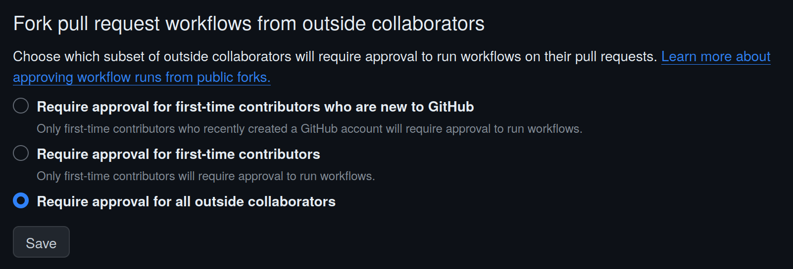

# Forking

You are welcome to contribute by forking and making pull requests.

Workflows in pull requests from forks always require [approval](https://docs.github.com/en/actions/managing-workflow-runs/approving-workflow-runs-from-public-forks#about-workflow-runs-from-public-forks) to run:

This ensures that untrusted workflows aren't run, which prevents [wasted Actions
minutes](https://docs.github.com/en/billing/managing-billing-for-github-actions/about-billing-for-github-actions#about-spending-limits)
and is a
prerequisite for using a [self-hosted runner for a public repository](https://docs.github.com/en/actions/security-guides/security-hardening-for-github-actions#hardening-for-self-hosted-runners).
